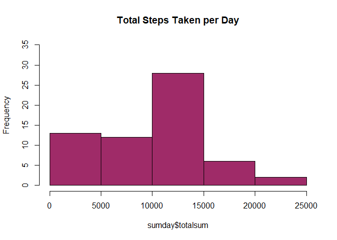
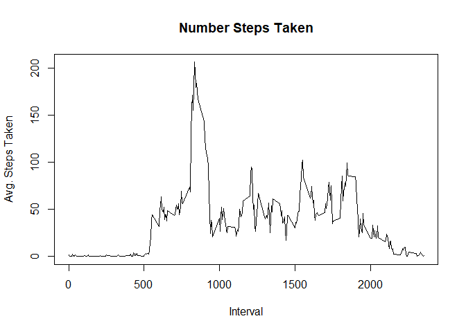
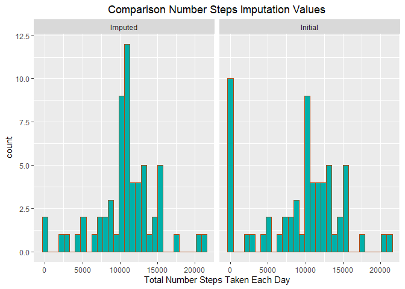
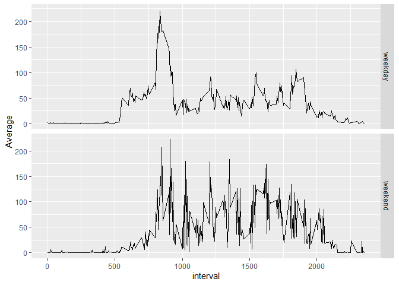

## Loading and preprocessing the data

```r
if(!file.exists("./data")){dir.create("./data")}
unzip(zipfile = "activity.zip",exdir = "./data")
```


```r
data <- read.csv("./data/activity.csv", sep = ",")
```

## What is mean total number of steps taken per day?
#### - Calcualte the total number of steps taken per day

```r
sumday <- with(data, tapply(steps, date, sum, na.rm = TRUE))
sumday <- data.frame(sumday)
names(sumday)[1] <- "totalsum"
```


```r
hist(sumday$totalsum, col = "#9F2B68", main = "Total Steps Taken per Day", ylim = c(0,35))
```

<!-- -->

#### - Calculate and report the mean and median of the total number of steps taken per day

```r
library(dplyr)
data %>% group_by(date) %>% summarise(mean = mean(steps), median(steps))
```

```
## # A tibble: 61 x 3
##    date         mean `median(steps)`
##    <chr>       <dbl>           <dbl>
##  1 2012-10-01 NA                  NA
##  2 2012-10-02  0.438               0
##  3 2012-10-03 39.4                 0
##  4 2012-10-04 42.1                 0
##  5 2012-10-05 46.2                 0
##  6 2012-10-06 53.5                 0
##  7 2012-10-07 38.2                 0
##  8 2012-10-08 NA                  NA
##  9 2012-10-09 44.5                 0
## 10 2012-10-10 34.4                 0
## # ... with 51 more rows
```
## What is the average daily activity pattern?


```r
interval_steps <- with(data, tapply(steps, interval, mean, na.rm = TRUE))
interval_steps <- data.frame(interval_steps)
interval_steps$interval <- rownames(interval_steps)
names(interval_steps)[1] <- "Average"
plot(as.numeric(interval_steps$interval), interval_steps$Average, type = "l",
     xlab = "Interval", ylab = "Avg. Steps Taken", main = "Number Steps Taken")
```

<!-- -->

#### The 5-minute interval, on average across all the days in the dataset, which contains the maximun number of steps is:


```r
max_interval <- max(interval_steps$Average)
interval_steps[interval_steps$Average %in% max_interval,2]
```

```
## [1] "835"
```
## Imputing missing values

#### - Calculate and report the total number of missing values in the dataset 

```r
sum(is.na(data$steps))
```

```
## [1] 2304
```
#### - Fill in all of the missing values in the dataset

```r
data2 <- data
data2$steps[which(is.na(data2$steps))] <- tapply(data2$steps, data2$interval, mean, na.rm = TRUE)
```


```r
sum_day <- with(data2, tapply(steps, date, sum, na.rm = TRUE))
sum_day <- data.frame(sum_day)
names(sum_day)[1] <- "totalsum"
```


```r
sumday$data <- "Initial"
sum_day$data <- "Imputed"
two_data <- rbind(sumday, sum_day)
```

#### - Make a histogram of the total number of steps taken each day and Calculate and report the mean and median total number of steps taken per day. 


```r
library(ggplot2)
ggplot(two_data, aes(totalsum)) + facet_wrap(~data) + geom_histogram(col = "#B0460C", fill = "#00B0AA",) + labs(x = "Total Number Steps Taken Each Day", title = "Comparison Number Steps Imputation Values") + theme(plot.title = element_text(hjust = 0.5))
```

<!-- -->

#### - Report the mean and median total number of steps taken per day

```r
library(dplyr)
data2 %>% group_by(date) %>% summarise(mean = mean(steps), median(steps))
```

```
## # A tibble: 61 x 3
##    date         mean `median(steps)`
##    <chr>       <dbl>           <dbl>
##  1 2012-10-01 37.4              34.1
##  2 2012-10-02  0.438             0  
##  3 2012-10-03 39.4               0  
##  4 2012-10-04 42.1               0  
##  5 2012-10-05 46.2               0  
##  6 2012-10-06 53.5               0  
##  7 2012-10-07 38.2               0  
##  8 2012-10-08 37.4              34.1
##  9 2012-10-09 44.5               0  
## 10 2012-10-10 34.4               0  
## # ... with 51 more rows
```


## Are there differences in activity patterns between weekdays and weekends?
#### - Create a new factor variable in the dataset with two levels – “weekday” and “weekend” indicating whether a given date is a weekday or weekend day.


```r
data2$typeday <- ifelse(weekdays(as.Date(as.character(data2$date))) == c("Saturday","Sunday"),"weekend","weekday")
```


```r
library(dplyr)
weekday_weekend <- data2 %>% group_by(typeday,interval) %>% summarise(Average = mean(steps))
```


```r
ggplot(weekday_weekend, aes(interval, Average)) + facet_grid(typeday~.) + geom_line()
```

<!-- -->


